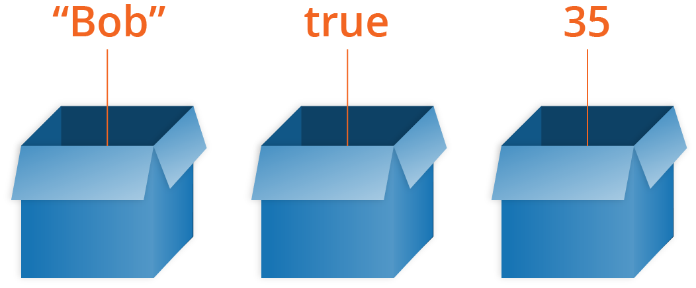

- HTML 是一种标记语言，用来结构化我们的网页内容并赋予内容含义，例如定义段落、标题和数据表，或在页面中嵌入图片和视频。

- CSS 是一种样式规则语言，可将样式应用于 HTML 内容，例如设置背景颜色和字体，在多个列中布局内容。

- JavaScript 是一种脚本语言，可以用来创建动态更新的内容，控制多媒体、制作图像动画等等。

---
# 变量
> **变量是用来储存熟知的，那么有一个重要的概念需要区分。变量不是数值本身，它们仅仅是一个用于储存数值的容器。你可以把变量想象成一个个用来装东西的纸箱子。**

> 千万不要把两个概念弄混淆了，"一个变量存在，但是没有数值" 和 "一个变量并不存在" — 他们完全是两回事 — 在上面的盒子的类比中，不存在意味着没有可以存放变量的 "盒子"。没有定义的值意味着有一个 "盒子"，但是它里面没有任何值。

   ## 变量类型
> Number， String， Boolean， Array， Object

* 数字类型 
* 字符串
     > #### 字符串方法
        > 字符串.length
        >
        > 字符串\[0\]、字符串[字符串.length - 1]
        > 
        > indexOf() 返回 -1 为找不到 [实例链接](./JavaScript实践/过滤问候语.html)
        > 
        > slice(开始提取的字符位置, 提取的最后一个字符的后一个位置(可选)) 不包含最后一个位置 [实例链接](./JavaScript实践/挑选地名.html)
        >
        > toLowerCase()
        >
        > toUpperCase() [实例链接](./JavaScript实践/大写修正.html)
        >
        > replace(要被替换下的字符串, 要被替换上的字符串) [实例链接](./JavaScript实践/大写修正.html)
        >
    课后习题 [过滤问候留言](./JavaScript实践/过滤问候语.html) [大写修正](./JavaScript实践/大写修正.html) [挑选地名](./JavaScript实践/挑选地名.html)

* 数组
    > #### 数组方法
        > 字符串和数组之间的转换 [实例链接](./JavaScript实践/字符串和数组之间的转换.html)
        > 
        > 添加和删除数组 [实例链接](./JavaScript实践/添加和删除数组.html)
    
    课后习题 [打印产品](./JavaScript实践/打印产品.html) [前5个搜索](./JavaScript实践/前5个搜索.html) 

课程完结习题 [笑话生成器](./JavaScript实践/笑话生成器.html)

